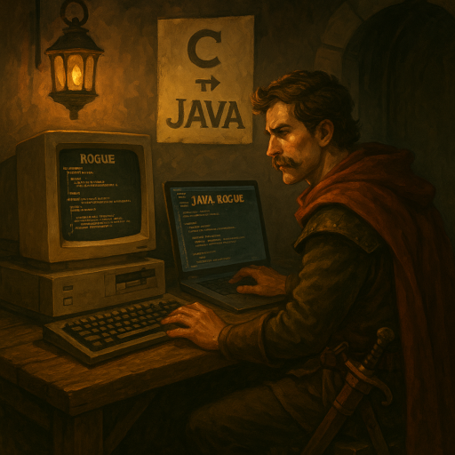

# Java Rogue

**Java Rogue** is a faithful reimplementation of the classic *Rogue* game, originally written in C, now ported to Java.
This port is based on the released C source code of *Rogue 5.4.4*, available at:  
https://github.com/Davidslv/rogue

## Status

**Early development.** Core systems like dungeon generation, gameplay mechanics, and rendering are currently being ported.

